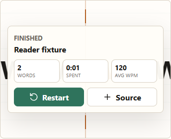
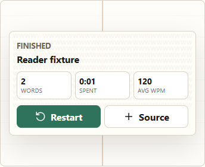

# WordFlow F1 R-1 narrow fix — mandatory STOP

Date: 2026-10-07. Builder: Codex (gpt-6.1-sol, high).

**STOP: a scrolling last word collides with the Finished panel.** The candidate is withdrawn;
`app.js` is restored byte-for-byte to the starting branch. R-1 remains open. The requested
"R-1 fix pending CC check" state has not been reached. No alternate finished-screen behavior
has been invented.

## Authority and source state

Started with clean `fix/f1-long-token` at `caa0d6537dc99ef2b3d883e2872c0e2ae5d10ac6`.
Master remains `b9d3d9eedf5f67b9b6c03742faae8cf35e3cb7e7`. Read repository AGENTS.md,
CLAUDE.md, W1-W6.12, HOSTING.md, Codex's round-3 report, CC's re-review (R-1 and decisions
1-3), its relevant probe/evidence, and the vault rules/context. W6.13 was recorded verbatim
under RULING W6 and committed alone as `16cb0acfd86be76c4d43f19df10b7ba3d0ff2209`
before changing code.

Marcus explicitly required STOP if a fitted or scrolling last word collides with the Finished
panel or other controls. This trigger takes precedence over proceeding to the full Step 2
verification or recording a candidate as ready for CC. W6.13 accepts O-2 and the landscape
note as they are; neither was changed.

## Labelled implementation choices (withdrawn candidate)

These are Codex implementation choices, not Marcus rulings:

- Remove only `state.finished` from the fitting early return. Keep master's existing fitting
  search and the W6.12/W6.1/W6.7 fitting, wrapping and scroll-area calculations.
- In the finished state, hide the note, omit its `aria-describedby`, omit the pause marker,
  and suppress the automatic `pause()` call. Keep the scroll region's existing geometry,
  keyboard stop, role and label. No CSS, panel, playback, restart or data-path changes.
- Run the collision STOP gate first, before the larger matrix. Use actual master and pre-fix
  committed frontend blobs served through the existing loopback helper, alongside the
  candidate, with production CSS. No test backdrop or modified panel.

The exact five-line candidate is retained in `results/f1-r1-fix/candidate.patch`. It is evidence
only; production `app.js` is restored.

## Before/after measurements and STOP

Installed Chrome 155.0.8059.39, bundled Playwright 1.62.1, Node 24.16.0. Browser plugin not
available; used the existing Chrome/Playwright workflow. No packages installed.

Flow: load `Lead W2000` through the existing fixture helper, seek to the final word, then
press the production `play()` path on the branch's final scroll token. Master is completed
with `completeReading()`; this is a controlled layout comparison, not natural full playback.
Viewport 390x844, comfortable/default word size, context on, focus letter on, normal mode.

All coordinates are CSS pixels. Frame inner width/height: 342 / 278, unchanged across all three.

| Finished measurement | Master b9d3d9e | Pre-fix caa0d65 | Withdrawn candidate |
|---|---|---|---|
| Font size | 10 px | 51.2 px | 10 px |
| Rendered text Range width | 20097.6875 | 102900.015625 | 301.5 |
| Word layout | fitted single line, clipped | unfitted single line, clipped | fitted, wrapped, scrolling |
| Display client height / scroll height | 11 / 12 | 55 / 60 | 130 / 708 |
| Note | hidden | hidden | hidden |
| Finished / playing / status | true / false / Finished | true / false / Finished | true / false / Finished |

Candidate scroll area: x 41.1015625-348.8984375, y 286.46875-416.46875, width 307.796875,
height 130. Finished panel: x 38-352, y 285.5625-461.375, width 314, height 175.8125.
Their intersection is **307.796875 x 130 = 40013.59375 square CSS pixels**: the entire
scroll area lies behind the panel. At the overlap center, `elementFromPoint` hits a panel
descendant, not the scroll region. The panel has z-index 3 and a translucent background;
the wrapped text is visibly painted through it. This is both a visible collision and pointer
occlusion. The scroll area has the same geometry as during reading, satisfying that part of
W6.13, but it cannot satisfy the task's no-collision STOP condition with the unchanged panel.

The candidate keeps the note hidden and the final status `Finished`; it does not enter the
auto-pause branch in this probe. This is not an exhaustive no-auto-pause guarantee.

**STOP reached in the first configuration.** No panel repositioning, word hiding, removal of
scrolling, opacity change or other workaround was attempted. Marcus must resolve the collision
requirement versus the unchanged Finished layout before further implementation.

### Figures

Master, pre-fix and candidate use the same production frame/panel styling.

Raw reading/finished rectangles, state, PNG hashes and environment:
`results/f1-r1-fix/finished-stop.json`. Reproduction script:
`results/f1-r1-fix/finished-probe.cjs`; it exits nonzero on STOP. To reproduce the candidate,
apply the retained patch in an isolated checkout of the recorded start/ruling commit. Running
the script on the restored production reader alone does not reproduce the withdrawn candidate.
The initial sandbox attempt was denied loopback access; the authorized escalated probe produced
these measurements. It recorded 0 page errors / 0 uploads. Console-error health was not monitored
by this small STOP probe.

## Restoration, scope and stamp

After preserving the patch and evidence, restored `app.js` to the exact starting bytes.
Restored SHA-256: `a3ba064933477e672e6774f1a05fbc72604608b0f2c5bc651034fa9145c38ba8`.
All production and test blobs equal the starting commit. Protected files and other agents'
reports/evidence remain untouched. No `.env` file opened, printed, copied or committed.
No merge, push, deployment, public listener or setting change.

Existing committed `tests/parity-stamp.json` SHA-256:
`4898c798858f2407ed3ca178d0ada55bbde8c71a0f75fa17085edf1549666f03`.
It is unchanged, not regenerated or edited; it describes the restored pre-fix inputs, not the
withdrawn candidate. Committed-blob stamp verification is recorded after the STOP records commit.

## NOT verified in this round

- Full nine-layout finished comparison; context off; large size; ordinary fitted examples
  `understanding.`, `kommunikasjon.`, `Kommune`; short words; the real 45-character word; W135.
- Fully visible master finished-word identity, natural full playback, resize while finished,
  restart equivalence, and all frame/control collision cases beyond the first STOP configuration.
- `npm test`, full `npm run parity`, new permanent finished smoke checks, the 78 registered
  mutation rerun, or the eight CC hand-mutants in Node/Chrome. Their previous results remain
  CC's re-review evidence, not results of this withdrawn candidate. Registry/source unchanged.
- Independent CC check, physical devices/touch, other browsers, zoom/DPR/fonts, Unicode/RTL,
  screen readers, hidden-tab playback, or live Cloudflare checks.

## Records and next action

Repository F1 and vault project/cache/current-state records state: **F1 (W6.1-W6.13) on
fix/f1-long-token; R-1 fix STOP on Finished-panel collision; not yet merged.** This explicitly
qualifies the requested success-state wording. Exact 20:50 Claude relay is appended, along with
the Codex worklog, wiki log/index and handoff. Today's dated daily note is absent; none created.
Scratch folders were not deleted.

Next: Marcus resolves how W6.13's retained scroll area may coexist with the Finished panel
under the no-collision requirement. Then resume only the authorized narrow scope, complete the
requested Step 2 checks and generated stamp, and obtain the short CC check before any separate
merge/push decision.
