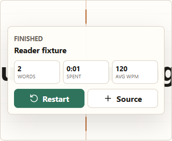
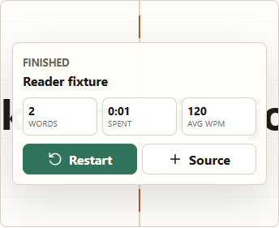
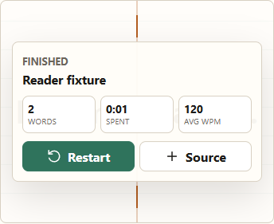
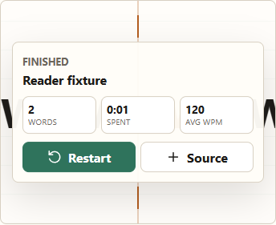
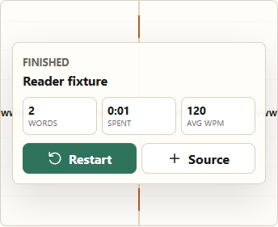
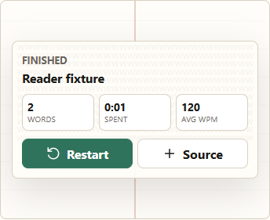

# WordFlow F1 R-1 resume under W6.14

Date: 2026-10-07. Builder: Codex (gpt-6.1-sol, high).

**F1 (W6.1-W6.14) on fix/f1-long-token; R-1 fix pending CC check; not yet merged.**
Builder verification passes. Independent CC acceptance remains pending; F1 is not declared fixed
under W6.11. No product STOP was established in the final passing matrix; the earlier capture
assertions and their limits are disclosed below.

## Authority and source state

Started clean on `fix/f1-long-token` at
`8ae3d54a5bbf5395dad1c0e2e7e27e0c2f01921e`. Master remains
`b9d3d9eedf5f67b9b6c03742faae8cf35e3cb7e7`.
Read the repository/vault rules and context, W6.13, the prior R-1 STOP report,
`results/f1-r1-fix/candidate.patch`, `finished-stop.json`, and `finished-probe.cjs`.
The earlier round-3 report, CC re-review (R-1 / decisions 1-3), and hosting rules remain in force.

W6.14 was appended verbatim under RULING W6 and committed alone before code as
`ec657901da4f2b07899ea0120ee2a12b0b733724`. Its overlay clarification supersedes the
previous STOP condition; the previous report and evidence are untouched. O-2 and the landscape
note remain accepted as ruled. No merge, push, deployment or installation.

## Labelled implementation choices

These are Codex implementation choices, not additional rulings:

- Reapply the preserved candidate: remove `state.finished` from the fitting early return;
  keep master's fitting search and W6.12/W6.1/W6.7 geometry; suppress the finished note, pause
  marker and automatic pause.
- Keep the existing scroll classes and rectangle on finish. Set `inert`, remove its tabindex,
  and omit role, label and accessible description. The existing reset clears those attributes.
  A scoped `[inert]` rule uses `overflow: clip` and `pointer-events: none` so the retained area
  cannot scroll or receive pointer input. The native inert property blocks focus.
- Clear inert in the existing layout reset. Only the non-finished scroll branch restores
  tabindex, role, label, description and note, including after restart, load or seek.
- Add `tests/reader-finished.cjs` to the permanent smoke entry point. Amend only the obsolete
  round-2 finished assertion that required removal of scroll geometry; it now requires inertness.
  The other reading assertions stay in place.

Product delta from the starting head: `app.js` (14 additions / 8 removals) and five CSS lines.
No playback, restart, data-path, proxy, Functions, server, R59, push-gate, vendor, `_headers`,
index/CSP or extraction change.

## Permanent finished-screen checks

The flow is: load a two-word fixture -> complete reading or use real Play through countdown and
both words -> inspect Finished -> restart -> verify the reading region after seek/load/restart.

Layouts are 390x844, 390x600, 844x390, 1400x950, 1708x950 and 1920x1080 normal mode;
996x950, 1400x950 and 390x844 focus mode. Each uses context on/off and comfortable (default) /
large size, with focus-letter highlighting on. Tokens: `understanding.`, `kommunikasjon.`,
`Kommune`, `here.`, `Tail`, `Pneumonoultramicroscopicsilicovolcanoconiosis` (45 characters),
W135 and W2000. `Kommune` is tested at both sizes, including large as requested.

Master pages serve actual committed master HTML/app/CSS blobs. Before pages use the starting
head. Four independent browser contexts schedule the layout groups; this is not agent delegation.
Natural playback uses the UI WPM slider at 900, real Play and countdown, with pacing flags off.
If the last word auto-pauses during reading, one Play finishes it through the production path.
The natural finish does not call `completeReading()` to reach Finished.

Checks require strict equality of font, computed rendering properties, classes, complete word DOM
and text/element rectangles for master-visible last words; frame-contained painted bounds for
master-clipped words; and unchanged reading scroll geometry. Paint-order hit tests require the
panel and any intersecting control above the word. Finished must have no note, pause call, pause
marker, region/label/description or tabindex. Forty Tab steps skip a scrolling last word; direct
focus, wheel and programmatic scroll fail. Both Restart and Play restart match master, including
index, state, status, countdown, word font/rectangle and panel/control state. Between the two
restart actions, the fixture is refinalized through the shared production completion function.

Only restart DOM comparison normalizes the inherited empty `style=""` artifact (CC O-1), proved
on the starting head; final master-visible word DOM equality is unnormalized. Candidate-only
Tab/wheel probes may scroll the document, so both pages are aligned to scrollY 0 before restart.
This changes test preconditions, not product scrolling or restart behavior.

For exact word-range PNG equality, the direct matrix uses a test-only flat frame background and
removes the panel shadow. Natural playback, bounds, stacking, inertness and figures use production
CSS. There is no pixel tolerance. If an initial PNG pair differs, one recapture is permitted only
after strict unchanged DOM/font/geometry checks; the second pair must match exactly or STOP.

## Verification results

Browser plugin not available; used the existing Playwright/installed-Chrome path with the
unchanged loopback server helper. Node 24.16.0, Chrome 155.0.8059.39, Playwright 1.62.1.
Machine-readable results and hashes are in
[verification-summary.json](results/f1-r1-resumed/verification-summary.json) and
[parity/manifest.json](results/f1-r1-resumed/parity/manifest.json).

| Check | Result |
| --- | --- |
| `npm test` | 505 passes / 0 skips: 223 regression, 169 proxy, 32 exposure, 81 post-review |
| Full `npm run parity` | 9 exact DOCX; all 7 PDFs asserted (5 exact / 2 pinned); 884 smoke / 0 skips |
| Smoke health | 0 app errors, 0 uploads, 0 unexpected external origins |
| Finished matrix | 288 direct + 288 natural cases; 108 seek/load/restart restoration actions |
| Master-visible final words | 196 direct cases: strict DOM/font/geometry and exact first-capture word-range PNG equality; **0 recaptures used** in the successful run |
| Master-clipped final words | 92 direct cases: painted word/aperture wholly inside the frame |
| Finished scroll states | 20 direct and corresponding natural cases: preserved rectangle, inert, no attributes/note/pause; Tab/focus/wheel/programmatic-scroll checks pass |
| Restart | Both controls match master in every direct/natural case, with the disclosed preconditions and inherited-attribute normalization |
| 78 registered mutations | 77 KILLED + equivalent M9; 0 unexpected / errors; all non-volatile rows, source specifications and source hash equal CC re-review |
| CC B1-B5 / S1-S3 hand-mutants | All eight KILLED in Node and Chrome; exact transforms and before/mutated/restored hashes recorded |
| UI identity / blank page / error overlay / interaction | Existing smoke checks pass; inspected production before/after phone figures and natural completion/restart evidence |
| Protected scope | No diff from the starting head in protected files, index/CSP, playback/restart functions or data paths |

The 884 smoke checks include all prior 272 plus 576 finished comparisons and 36 grouped
restoration checks (three actions each). Natural production-CSS comparisons also enforce the
master-visible DOM/font/geometry equality and all bounds/order/inert/restart assertions. The
fully visible and clipped counts refer to geometrical visibility within the frame before the
existing translucent Finished overlay.

Evidence: [npmtest.txt](results/f1-r1-resumed/npmtest.txt),
[parity-final.txt](results/f1-r1-resumed/parity-final.txt),
[reader-finished.json](results/f1-r1-resumed/parity/reader-finished.json),
[mutation-comparison.json](results/f1-r1-resumed/mutation-comparison.json), and
[hand-mutants.json](results/f1-r1-resumed/hand-mutants.json). The hand-mutants use CC's existing
Node and in-browser predicate checks, including the five browser kills through direct predicate
calls; they are not claimed as eight new interaction-only kills. The product raw app SHA-256 is
`cca5c4b5522ddaff9b0c15fbfc0c21c69072f098b2fe45e0261d668478fcf891`, unchanged across those runs.

## Finished-screen before/after measurements

Production CSS, natural finish, 390x844 normal mode, context on, comfortable size. Before is the
starting-head finished screen; master is b9d3d9e. Coordinates are CSS pixels (rounded below;
complete values in JSON). Frame inner bounds are x=24..366, y=234.469..512.469 in every case.

| Last word | Before font | Master font | After font | After rectangle (width x height; x/y range) |
| --- | --- | --- | --- | --- |
| `understanding.` | 51.2 px | 43 px | 43 px | 306.984 x 46.438; x=41.5..348.484, y=350.25..396.688 |
| `kommunikasjon.` | 51.2 px | 39 px | 39 px | 303.875 x 42.109; x=43.063..346.938, y=352.406..394.516 |
| W2000 | 51.2 px, unfitted | 10 px, clipped horizontally | 10 px, inert scroll aperture | 307.797 x 130; x=41.102..348.898, y=286.469..416.469 |

At this viewport, large `Kommune` matches master's 63 px; comfortable `here.` and `Tail` match
51.2 px; the real 45-character word matches 13 px; W135 wraps at 10 px inside the frame. W2000
retains the reading scroll-area rectangle, becomes inert, and has no tabindex, role, label,
description, note or pause marker. The panel remains above it at z-index 3. Panel coverage is
master's existing design under W6.14, not a collision. No final matrix case paints outside the
inner frame or above a panel/control, or changes a master-visible word's measured rendering.

The pre-fix `understanding.` snapshot (51.2 px versus master's 43 px) demonstrates the exact
font mismatch that the new permanent master-visible assertion rejects; this closes the prior
finished-state testing gap rather than merely checking that Finished appears.

## Generated stamp

The successful full command generated `tests/parity-stamp.json`; it was not hand-edited.
SHA-256: `3ca46f922440c6f6a131252b61f0005b58941e7b9e863679861384ed91ddebdf`.
All 225 inputs remain registered; only `app.js` and `styles.css` hashes differ from the starting
stamp. Normalized committed-input hashes:

- app.js: `74c62daa23abcc2a0bcc6cf141c24d32f3d217b4e6b93b77f326a8abb2d73da9`
- styles.css: `d3e6a11d9346f398497de01f1053a5bd7435953cf7233e8c315b4a49422ca107`

The generated stamp is included in the local candidate commit. Committed-blob verification is
performed after that commit; no push gate or deployment is invoked.

## Harness findings and incomplete attempts

The product app/CSS bytes stayed unchanged throughout these harness repairs. Earlier failed or
interrupted runs did not generate a stamp and are not successful parity claims:

| Attempt | Observed result and handling |
| --- | --- |
| 1 | Sequential click waits let master finish before candidate's restart snapshot; capture both real click handlers immediately in their event tasks. |
| 2 | Intentionally interrupted after 8 direct / 8 natural cases while repairing inactive-tab animation-frame waits; settle foreground pages. |
| 3 | Whole-frame PNG differed at 20 rail pixels outside the word; compare the complete text Range instead. |
| 4 | Restart differed only by empty style attribute; reproduce on starting head and normalize that inherited artifact for restart only. |
| 5 | Intentionally interrupted to schedule independent layout groups in four contexts. |
| 6 | 13 pixels / one RGB-channel-level variation under production panel shadow; fresh unchanged candidate also matches exactly. Preserve raw pairs and use the controlled pixel backdrop. |
| 7 | Candidate-only input probes scrolled the page 613 px; document coordinates and aligned restart match master exactly. |
| 8 | Windows `UNKNOWN` on a repeated evidence-file write after over 230 pairs passed; write each group's evidence once at completion. |
| 9 | Controlled focus capture differed at 92 pixels, max two RGB levels; 12 fresh master and four fresh candidate controls all match exactly. Require unchanged-state exact recapture, without tolerance. |

The source of screenshot variation is **not verified**. Transient capture/compositing variation is
an inference from identical DOM/geometry and exact fresh captures, not an established Chrome cause.
The initial raw PNG pairs, decoded pixel deltas and reproduction controls are retained. Do not
interpret controlled-backdrop equality as byte identity of all production screenshots.

## Records and next action

AGENTS.md F1 and the vault project/hot-cache/current-state records now state: **F1 (W6.1-W6.14)
on fix/f1-long-token; R-1 fix pending CC check; not yet merged.** Codex worklog, wiki index/log
and handoff are updated. The exact requested 21:55 Claude relay is appended. Today's dated daily
note is absent; none created. Historical STOP and CC reports/evidence remain untouched.

Next: the short CC check of this R-1 fix only, then Marcus's separate merge/push decision through
the existing gate and post-deploy `smoke:live`. No merge, push or deployment is authorized here.

## NOT verified

- Independent short CC check or acceptance under W6.11/W6.13/W6.14.
- A new browser-denied Node run or independent fresh-clone verification in this builder round;
  CC's earlier reproduction remains its own evidence.
- First-capture or whole-frame production PNG byte identity beneath the translucent panel.
- Physical touch devices, screen readers, other browsers, zoom/DPR/font configurations,
  Unicode/RTL/grapheme cases, sustained hidden-tab playback, or every token/size/viewport.
- A new finished-screen matrix with focus-letter highlighting off or compact size. Existing
  reading/preservation checks still run; this matrix uses the requested default and large sizes.
- Live deployment or the existing Cloudflare quota/CPU/fail-open/logging/request-count questions.

CC scratch folders were not deleted. The isolated hand-mutation temp clone is retained.

## Figures — production CSS

Each row below is starting-head before, master, then candidate after. These depict the existing
translucent overlay and are not the controlled pixel-test backdrop.

`understanding.`:

`kommunikasjon.`:

W2000:

Agent: Codex (gpt-6.1-sol, high)
